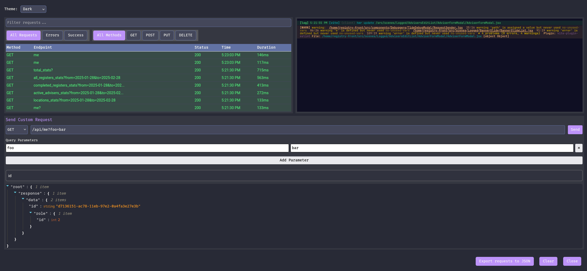

# Tide Debug Modal

A powerful React component for debugging HTTP requests and terminal logs in development environments. It intercepts fetch requests, allows sending custom requests, streams Vite logs via WebSocket, and provides a detailed breakdown of request/response data with JSON filtering and theme support.



## Features

- **HTTP Request Interception**: Automatically captures all fetch requests made in your app, displaying method, endpoint, status, duration, and more.
- **Custom Request Sender**: Send custom HTTP requests (GET, POST, PUT, DELETE) with query parameters and payloads directly from the UI.
- **Terminal Log Streaming**: Streams Vite logs (e.g., console.log, console.error, warnings, errors) via a WebSocket server.
- **JSON Filtering**: Filter request/response JSON data interactively by key or value.
- **Request Details**: View detailed breakdowns of requests, including headers, bodies, and Symfony profiler integration (if available).
- **Replay Requests**: Re-send captured requests to test endpoints.
- **Theme Support**: Choose between dark, monokai, and normal themes.
- **Keyboard Shortcuts**: Quick access with shortcuts like Alt+S (toggle modal), Alt+E (last error), and Escape (close).


## Demo

Run the included demo app to see it in action:
```bash
bun run dev
```

Click "Make Sample Request" to test request capturing, or edit the code to see Hot Module Replacement (HMR).

## Installation

### As a Dependency

Install via Bun (or npm):
```bash
bun add tide-debug-modal
```

Ensure peer dependencies are installed:
```bash
bun add react react-dom
```

### Requirements

- React: ^18.2.0
- Vite: ^4.0.0 (for WebSocket log streaming and HMR)
- Bun: Recommended runtime and package manager (Node.js also supported)

## Usage in Another Project

### Basic Usage

Add the component to your app:
```jsx
// src/App.jsx
import React from 'react';
import TideDebugModal from 'tide-debug-modal';

function App() {
    return (
        <div>
            <h1>My App</h1>
            <TideDebugModal />
        </div>
    );
}

export default App;
```

### Enable Log Streaming

To stream Vite logs (e.g., console.log, warnings), add the included viteLogStreamer plugin to your Vite config:
```javascript
// vite.config.js
import { defineConfig } from 'vite';
import react from '@vitejs/plugin-react';
import { viteLogStreamer } from 'tide-debug-modal/utils/viteLogStreamer';

export default defineConfig({
    plugins: [
        react(),
        viteLogStreamer(),
    ],
    server: {
        open: true
    },
});
```

The plugin starts a WebSocket server (default port 5174, dynamically incremented if in use) to stream logs to the modal's TerminalPanel.

### Run Your Project
```bash
bun run dev
```

The modal appears as a ⚡ button in the bottom-right corner. Click it to open, or use shortcuts like Alt+S.

## Development

### Getting Started

1. Clone the repository:
```bash
git clone https://github.com/yourusername/tide-debug-modal.git
cd tide-debug-modal
```

2. Install dependencies:
```bash
bun install
```

3. Run the demo app:
```bash
bun run dev
```
- Opens http://localhost:5173 with a sample page to test request capturing.

### Building the Library

Build the library for distribution:
```bash
bun run build:lib
```

Outputs to dist/ with CommonJS (index.js) and ES Module (index.esm.js) formats.

### Watching for Changes

To continuously rebuild the library during development:
```bash
bun run watch:lib
```

Rebuilds dist/ on file changes.

### Project Structure
```
tide-debug-modal/
├── src/
│   ├── components/               # Component directory
│   │   └── TideDebugModal.jsx   # Main component
│   ├── utils/                    # Helper functions and viteLogStreamer plugin
│   ├── App.jsx                  # Demo app
│   └── main.jsx
├── index.html                    # Main HTML file
├── vite.config.js               # Vite configuration
├── package.json
├── vite.lib.config.js           # Library build config
└── README.md
```

## Using with Another Project During Development

To develop tide-debug-modal while using it in a main project without publishing to npm:

### Symlink Approach (Recommended)

1. Build the Library Locally:
```bash
cd tide-debug-modal
bun run watch:lib
```
- Continuously rebuilds dist/ on changes.

2. Symlink to Main Project:
    - Using Bun:
   ```bash
   cd tide-debug-modal
   bun link
   cd ../main-project
   bun link tide-debug-modal
   ```
    - Manually:
   ```bash
   cd main-project/node_modules
   ln -s ../../tide-debug-modal tide-debug-modal
   ```

3. Run Main Project:
```bash
cd main-project
bun run dev
```
- Changes in tide-debug-modal/src/ rebuild to dist/, and main-project reflects them via the symlink.

### Source Symlink (Alternative)

For instant HMR without rebuilding:

1. Update package.json:
```json
"main": "src/components/TideDebugModal.jsx",
"module": "src/components/TideDebugModal.jsx"
```

2. Symlink Source:
```bash
cd main-project/node_modules
ln -s ../../tide-debug-modal tide-debug-modal
```

3. Update Main Project's Vite Config:
```javascript
import { defineConfig } from 'vite';
import react from '@vitejs/plugin-react';
import path from 'path';

export default defineConfig({
    plugins: [react()],
    resolve: {
        alias: {
            'tide-debug-modal': path.resolve(__dirname, '../tide-debug-modal/src/components/TideDebugModal.jsx'),
        },
    },
    server: {
        open: true
    },
});
```

4. Run Main Project:
```bash
bun run dev
```
- Changes in tide-debug-modal/src/ are picked up instantly via HMR in main-project.

## Contributing

1. Fork the repository.
2. Create a branch: `git checkout -b feature/your-feature`.
3. Make changes and commit: `git commit -m "Add your feature"`.
4. Push to your fork: `git push origin feature/your-feature`.
5. Open a Pull Request.

### Tips

- Test changes in the demo app (`bun run dev`) or symlink to your project.
- Ensure HMR works by editing a component (e.g., TideDebugModal.jsx) and checking for instant updates.

## Publishing to npm

1. Build the library:
```bash
bun run build:lib
```

2. Publish:
```bash
bunx npm login
bunx npm publish --access public
```
- Revert main and module in package.json to dist/ paths before publishing.

## License

MIT

## Author

Your Name